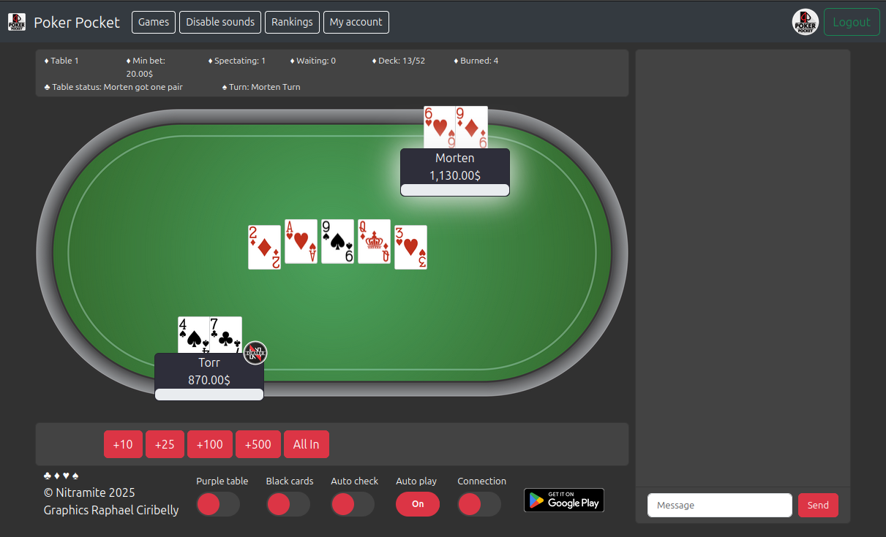

# Poker Pocket React Client

This project is a React version of [poker-pocket-web-client](https://github.com/norkator/poker-pocket-web-client) and
it's web project which brings web ui for following game backend:

[Poker-Pocket-TS-Backend](https://github.com/norkator/poker-pocket-ts-backend)

Samples
============

Current staging: https://pokerpocket-staging.nitramite.com  
Current production: https://pokerpocket.nitramite.com

Requirements
============

1. You need this back end set up: https://github.com/norkator/poker-pocket-ts-backend
2. `npm install` and `npm run start`

Contributors
============

### Current

* [norkator](https://github.com/norkator) developing this fork.

### Origins

* [linus2code](https://github.com/linus2code) created this React version.
* React version is based on this old jquery version https://github.com/norkator/poker-pocket-web-client

Graphics and sounds
============

### Raphael Ciribelly

* Designed and created all card, table, logo and chip images.

### Kenney Assets

* All medal images.
* Currently all sounds.

Kenney asset packs: https://kenney.nl/assets

License
============
MIT
